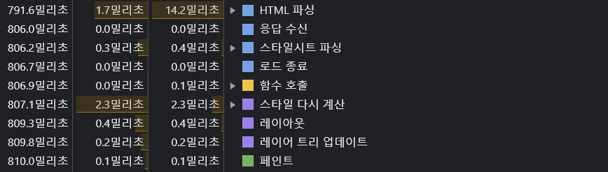

# 브라우저 렌더링

> 브라우저를 통해 화면에 나타나는 요소들은 렌더링 엔진을 사용합니다. 크롬은 블링크, 사파리는 웹킷 그리고 파이어 폭스는 게코 엔진을 사용합니다.

---

## Critical Rendering Path (CRP)

> 웹 브라우저는 CRP 프로세스를 통해 렌더링한 요소들을 화면에 그려냅니다.

1. HTML을 파싱하고 DOM(Document Object Model) 트리를 만듭니다.

2. CSS를 파싱하고 CSSOM(CSS Object Model) 트리를 만듭니다. CSS를 활용하지 않더라도 브라우저가 가진 기본 스타일 시트 'Computed Style'이 적용됩니다.

3. 자바스크립트 코드를 불러오고 해석하고 실행합니다. HTML 파서는 `<script>` 태그를 발견하면 파싱을 멈추고 자바스크립트 코드를 먼저 실행합니다. 왜냐하면 자바스크립트는 전체 DOM 구조를 바꾸는 `document.write()` 같은 방법으로 문서의 구성을 바꿀수 있기 때문입니다.

4. DOM과 CSSOM을 결합하여 렌더링 트리를 만듭니다.

5. 뷰포트를 기준으로 계산된 스타일이 있는 DOM 트리를 지나 레이아웃 트리를 만듭니다.

6. 메인 스레드가 레이아웃 트리를 따라가며 페인트 기록을 생성하고 컴포지팅을 통해 페인트 기록을 스크린의 픽셀로 바꾸어 화면에 전송합니다.

## 크롬 개발자 도구를 통해 CRP를 확인

사용 코드 : [github/po4tion](https://github.com/po4tion/Vanilla-JS-toyproject/tree/master/Animated-Navigation)

### 출처

[Mariko Kosaka](https://developers.google.com/web/updates/2018/09/inside-browser-part3?hl=ko)  
[Naver D2](https://d2.naver.com/helloworld/59361)
