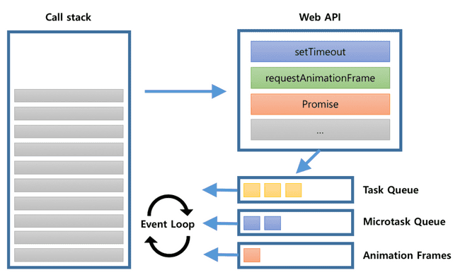
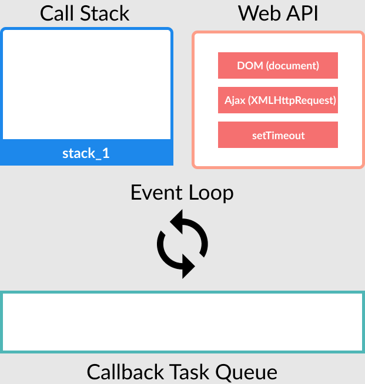
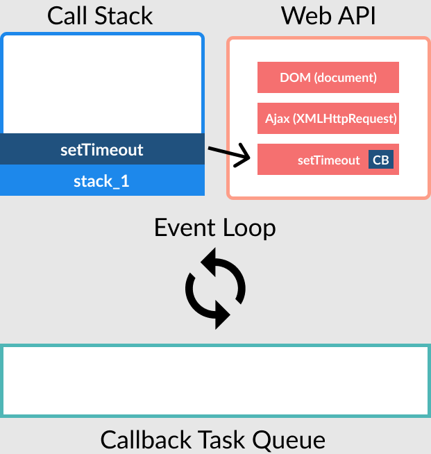
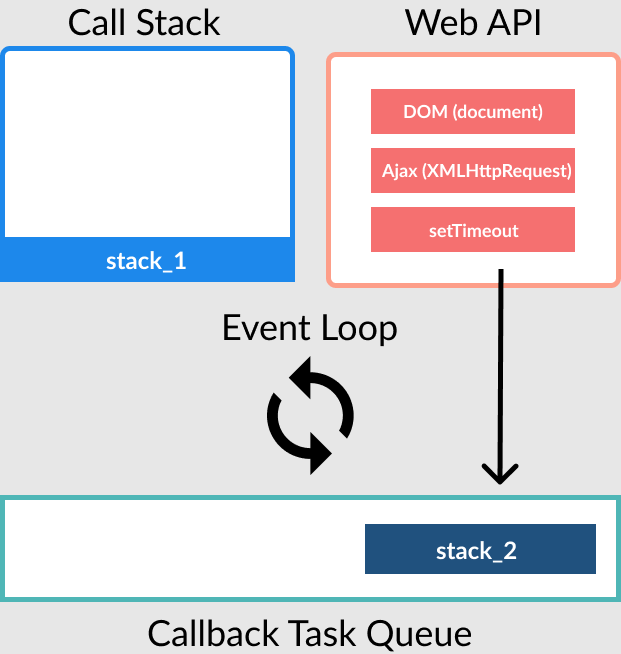
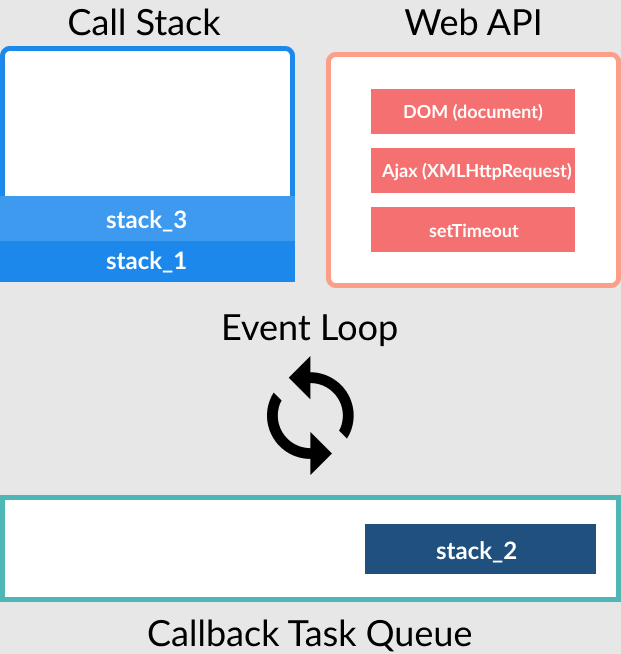
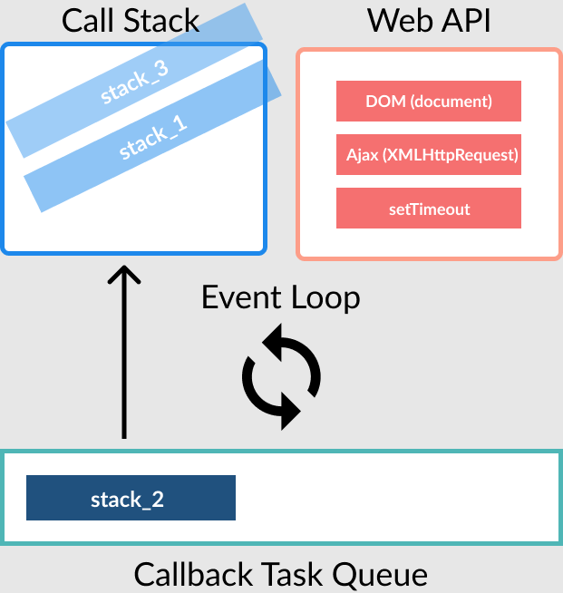
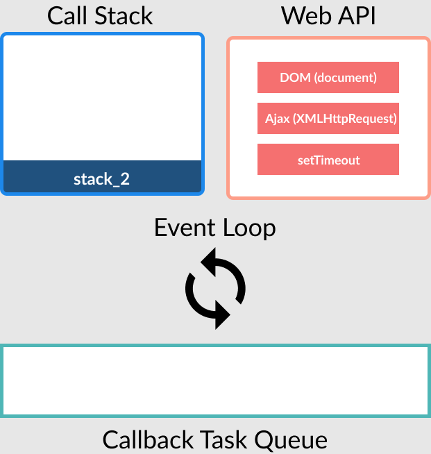

# Event Loop

---



> JavaScript 런타임 환경은 Call Stack, Web API, Callback Task Queue, Event Loop로 구성되어 있습니다.

JavaScript는 하나의 스택을 가지고 있고 동시에 단 하나의 작업만 할 수 있습니다. 이런 JavaScript가 여러 작업을 비동기로 할 수 있는 이유는 queue의 task들을 관리해주는 event loop가 있기 때문입니다.

```javascript
function stack_1() {
 console.log('stack_1');

 stack_2();
}

function stack_2() {
 const web_api = setTimeout(function () {
  console.log('stack_2');
 }, 0);

 stack_3();
}

function stack_3() {
 console.log('stack_3');
}

stack_1();

/* 
  stack_1
  stack_3
  stack_2
*/
```

위의 코드를 예로 설명하겠습니다.

- stack_1이 call stack에 들어가서 출력되고 `setTimeout()`이 call stack에 등록됩니다. Web API에게 setTimeout을 요청하면서 callback 함수를 전달합니다. 전달 후에 call stack에서 `setTimeout()`이 제거됩니다. `setTimeout()` 작업이 완료되면 task queue에 등록됩니다.







- stack_3이 call stack에 들어가서 출력됩니다.



- 연결되어 있던 모든 함수들의 작업이 끝났으므로 call stack에 최상단에 있는 stack_3부터 선입후출 구조로 제거됩니다.



- call stack에 남은 작업이 없으므로 task queue에 등록된 작업을 call stack으로 가져와 실행합니다.


