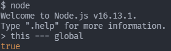

# This

> this의 값은 함수를 호출한 방법에 의해 결정됩니다.

---

호출 방법에 대해 알아보기 전 window와 global 객체를 살펴봅니다.

## 전역 객체

```javascript
// browser
this === window; // true

// terminal
this === global; // true
```

- browser  
  
- terminal  
  

## 객체의 메소드를 호출할 때

```javascript
const obj = {
 name: 'foo',
 sayName() {
  console.log(this.name);
 },
 sayThis() {
  console.log(this);
 },
};

obj.sayName(); // foo
obj.sayThis(); // {name: 'foo', sayName: ƒ, sayThis: ƒ}
```

객체의 프로퍼티가 함수일 경우 메소드라고 합니다. 이때 메소드 내부의 `this`는 메소드를 소유한 객체 `obj`를 가리킵니다.

## 내부함수를 호출할 때

```javascript
var value = 128;

const obj = {
 value: 777,
 foo() {
  console.log(this.value); // 777

  function bar() {
   console.log(this.value); // 128
  }

  bar();
 },
};

obj.foo();
```

내부함수인 `bar`는 전역변수 `value`의 값을 가져옵니다.  
위의 코드에서 최상단의 value 선언을 const나 let으로 변경해봅니다.

```javascript
const value = 128;
let value2 = 13;

const obj = {
 value: 777,
 value2: 244,
 foo() {
  console.log(this.value); // 777
  console.log(this.value2); // 244

  function bar() {
   console.log(this.value); // undefined
   console.log(this.value2); // undefined
  }

  bar();
 },
};

obj.foo();
```

`const`와 `let`으로 선언된 변수들이 `undefined`값을 가지는 이유는 `var`만이 가지는 특성에 이유가 있습니다. `var`로 선언된 전역 변수들은 전역 객체의 프로퍼티가 됩니다.

- var  
    
  

- const & let  
    
  

## 생성자 함수를 호출할 때

```javascript
function Person(name) {
 this.name = name;
}

const me = new Person('Kim');
console.log(me); // Person {name: 'Kim'}

const you = Person('Kim');
console.log(you); // undefined
```

`new` 연산자와 함께 생성자 함수를 호출하면 다음과 같은 수순으로 동작합니다.

1. 빈 객체가 생성되고 생성자 함수의 프로퍼티가 가리키는 객체를 자신의 객체로 설정합니다.
2. 반환문이 없는 경우 `this`로 바인딩한 객체가 반환됩니다.

## bind, apply, call 호출을 통한 명시적 바인딩

### bind

```javascript
var value = 128;

const obj = {
 value: 777,
 foo() {
  console.log(this.value); // 777

  const bar = function () {
   console.log(this.value); // 777
  }.bind(this);

  bar();
 },
};

obj.foo();
```

### apply

```javascript
var value = 128;

const obj = {
 value: 777,
 foo() {
  console.log(this.value); // 777

  const bar = function () {
   console.log(this.value); // 777
  };

  bar.apply(this);
 },
};

obj.foo();
```

### call

```javascript
var value = 128;

const obj = {
 value: 777,
 foo() {
  console.log(this.value); // 777

  const bar = function () {
   console.log(this.value); // 777
  };

  bar.call(this);
 },
};

obj.foo();
```

## 화살표 함수 호출

```javascript
var value = 128;

const obj = {
 value: 777,
 foo() {
  console.log(this.value); // 777

  const bar = () => {
   console.log(this.value); // 777
  };

  bar();
 },
};

obj.foo();
```

화살표 함수 내부의 this는 상위 lexical scope의 this에 가리킨다.
