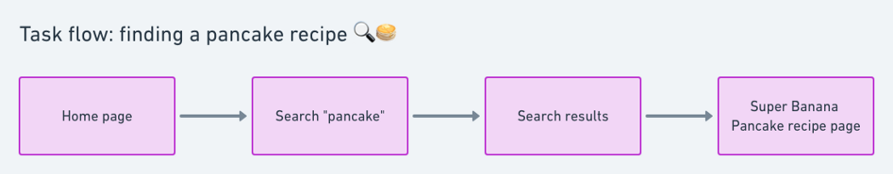
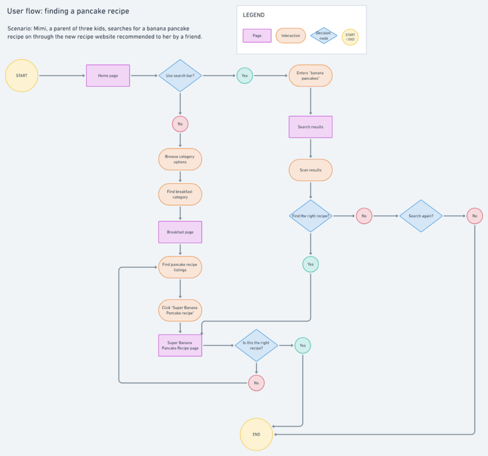

# Task flows vs User flows

> Task flows와 User flows는 모두 UX 설계 프로세스의 상호 작용 설계 단계 내에서 일반적으로 유용한 결과물이다. 설계의 내용과 특징에 걸쳐 구조, 계층, 조직 및 관계를 매핑하여 설계를 사용하는 사람들이 유동적으로 탐색할 수 있도록 한다.

---

## Task flows

- 단일 작업에 초점을 맞춘다
- 선형적인 경향이 있어 특정 목표나 종착점에 도달하기 위해 취하는 높은 수준의 단계를 보여준다.(서비스에 가입하거나 사용자의 장바구니에 물건을 추가하는 등) Task flows는 일반적으로 분기되지 않는 경향이 있고 일반적으로 복잡하기 보다는 단순하다.

## User flows

- 특정 사용자에 초점을 맞춘다
- 일련의 Task flows는 User flows에 포함될 수 있지만, Task flows와 달리 User flows는 설계와 상호작용 할 때 사용자의 결정에 따라 사용자 마다의 종착점에 도달하기 위한 방법이 다르다. 일반적으로 User flows는 Task flows보다 복잡한 경향이 있다.

### 참고

[erika harano](https://medium.com/erika-harano/ux-task-flows-versus-user-flows-as-demonstrated-by-pancakes-896e78a98026)  
[Brianna Aikens](https://medium.com/@briannacaikens/flowcharts-user-flows-and-task-flows-oh-my-b866e7abf6a0)
