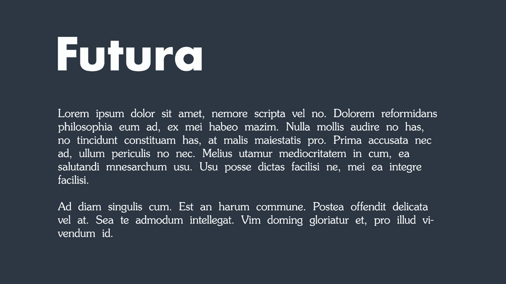
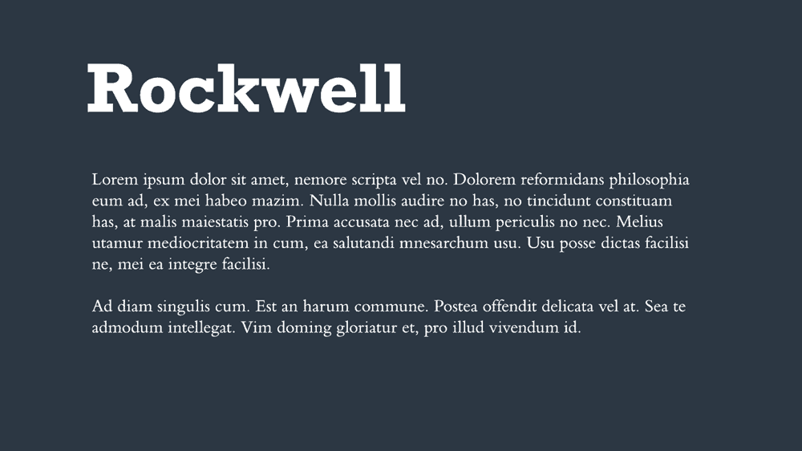
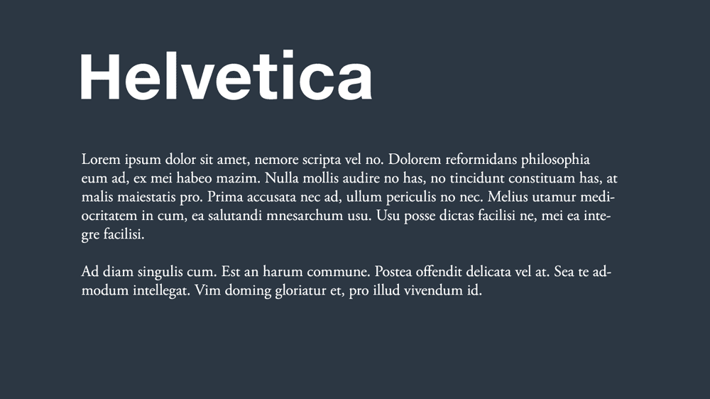

# Font pairing

> 동일한 프로젝트 내에서 서로 다른 폰트를 어울리도록 매칭하는 것을 Font Pairing 이라고 한다.

---

## 올바른 font pairing

1. 브랜드 성격을 명확히 하라.
2. 비슷한 글꼴 유형을 사용하지 마라.
3. 3개 이하의 글꼴을 사용하라.
4. 기본 설계 원칙(제목, 부제목, 본문 세 가지 글꼴을 준비)을 지켜라.
5. Typography의 구조를 이해하라.
6. Font pairing에는 정답이 없다. 정답은 없지만 잘못된 font pairing은 존재한다.

---

## Best font pairing

### Futura Bold & Souvenir

### Rockwell Bold & Bembo

### Helvetica Neue & Garamond

---

### 출처

[Ayushree Thapa](https://blog.designs.ai/2020/07/27/the-importance-of-font-pairing-how-to-get-good-at-it/)  
[Daniella Alscher](https://www.g2.com/articles/font-pairing?__cf_chl_jschl_tk__=3f20Qp31R32VQSUoM9zrHW2nJIs4QhPJAqLN1mWplqg-1641304746-0-gaNycGzNCL0)  
[INKBOT DESIGN](https://inkbotdesign.com/font-combinations/)
