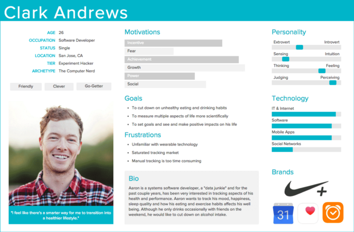

# Persona

---

## UX에서 페르소나는 무엇일까?

- 페르소나는 UX 디자인에 일반적으로 사용되는 도구이다.
- 어떤 제품 혹은 서비스를 사용할 만한 목표 인구 집단 안에 있는 다양한 사용자 유형들을 대표하는 가상의 인물이다.
- 페르소나 구현은 행동 패턴, 목표, 동기 부여, 기술, 태도, 배경 정보뿐만 아니라 작동하는 환경을 포함한다.

## 페르소나는 어떻게 만들까?

1. 사용자로부터 동기, 기대, 어려움, 과제, 목표에 대한 데이터를 수집한다.
2. 사용자의 목표뿐만 아니라 행동 패턴, 보편적, 특정한 욕구를 탐구함으로써 수집된 데이터를 조화시킨다.
3. 마지막으로 얼굴, 생각, 두려움, 배경 이야기를 가진 인물을 만든다.

## 페르소나는 왜 디자인 프로세스에 적합할까?

- 페르소나는 "우리는 누구를 위해 디자인하고 있는가?"라는 질문에 답한다.
- 제품과 서비스의 목표 그룹을 정의하는 것은 UX와 서비스 설계의 기본 원칙 중 하나이다.
- 주의할 점은 모두를 위해 디자인하려고 하지마라. 만약 모두를 위해 디자인한다면 결국 아무것도 디자인하지 않을 것이다.

## 페르소나의 용도는 결국 무엇일까?

- 페르소나는 우리가 서비스하고자 하는 사용자 그룹을 대표하기 때문에, 사용자들이 어떤 기대, 어려움, 행동, 최종 목표를 가지고 있는지를 알려줌으로써 설계 과정에서의 길을 이끌어준다.
- 페르소나는 최종은 아니며 끊임없이 변화할 수 있다.

### 참고

[Ergomania UX](https://ergomania-ux.medium.com/the-ultimate-guide-to-creating-personas-and-how-to-use-them-to-enhance-your-business-1066b0d1f50b)
